# Django Payroll Management System: HR MANAGER
## Description
The Django Payroll Management System is a web-based application designed to manage employee payroll, salary and related data. 
It includes features such as employee management, salary year configuration, salary data generation, and reports for both current and previous years. An **export** in excel is also possible. This project leverages Django for backend processing and database management, and uses templates for the fronted user interface.

This app is called 'HR MANAGER' and it is part of a larger project called 'OCTOPUS', have a look at the schematic:

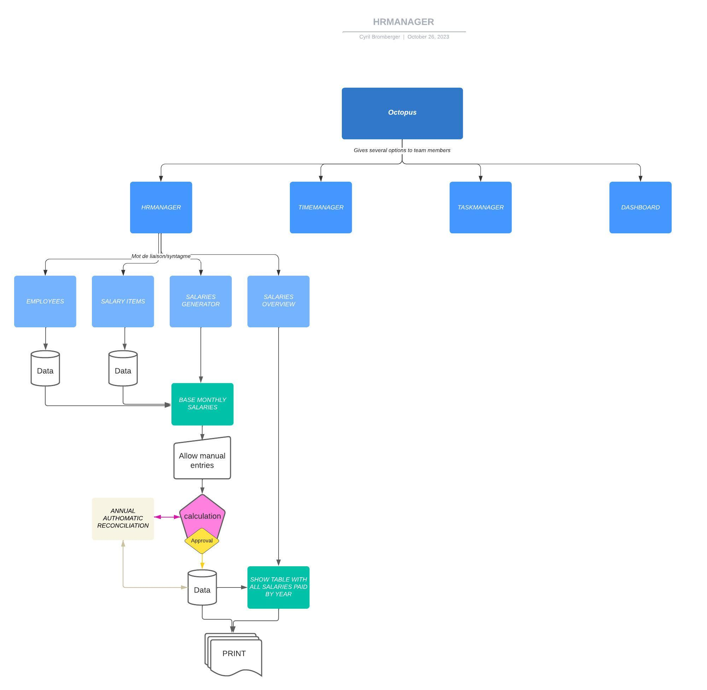


## Features
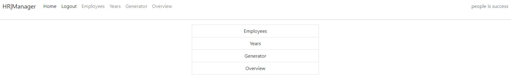

- Employees: Add, modify, and delete employees. Employees can be marked as active or inactive. 
    *(for modification and deletion, only possible if no data is generated using it.)*
- Year: Add, modify, and delete years.
    *(for modification and deletion, only possible if no data is generated using it.)*
- Generator: Generate monthly salary data for active employees, with the ability to save, modify, delete, pay, and reopen for each month of the year.
- Overview: View aggregated data in charts to compare salary data over different months and years, you also have the possiblity to export in excel.

As it is a Process oriented app, you need to create 'Employees' and 'Years' before generating any salary and overviewing them. Moreover you need to go through specific steps in order to achieve the payroll monthly job. 

### First, view the list of employees:
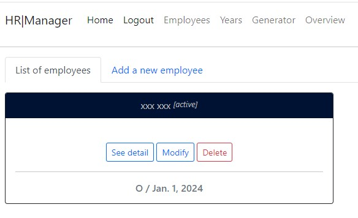

You can see [active] as well as [inactive] employees. You can 'See detail', 'Modify' and 'Delete' every employee under the condition that they were not already involved in a monthly salary process. You have also the possibility to 'Add a new employee'. All CRUD (Create/Read/Update/Delete), data validation for forms as well as messaging to the client are properly handled, in order to offer the best client experience.   

Here you will be able to save personal information, like the name, gender, marital status, age, day of birth, but also the wages elements of the employee. These information will be used in each run of the monthly salary process. 

### Second, view the list of years:
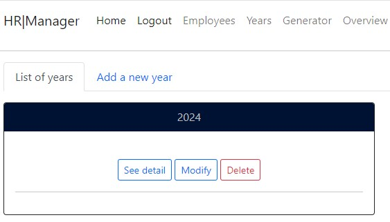

You can see each year that you created. You can 'See detail', 'Modify' and 'Delete' every year, under the condition that this year as not been used already. You have also the possibility to 'Add a new year'. All CRUD (Create/Read/Update/Delete), data validation for forms as well as messaging to the client are properly handled, in order to offer the best client experience. 

Here you will be able to save global information, like the rates for each social insurance the employer needs to pay. These information will be used in each run of the monthly salary process. 

### Third, the salary process in itself:
#### A) Select the year:
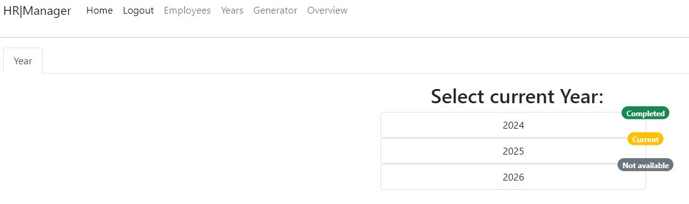

You can see each 'year' that you created under the second step. You also can see whether the 'year' is **Completed** (all 12 months have been 'paid'), **Current** (not all, can also be zero, meaning it is the next process in line) or **Not available**.
*Note: it does not make sense to be able to pay february 2026, when november 2025 has not been 'paid'*

#### B) Select the month:
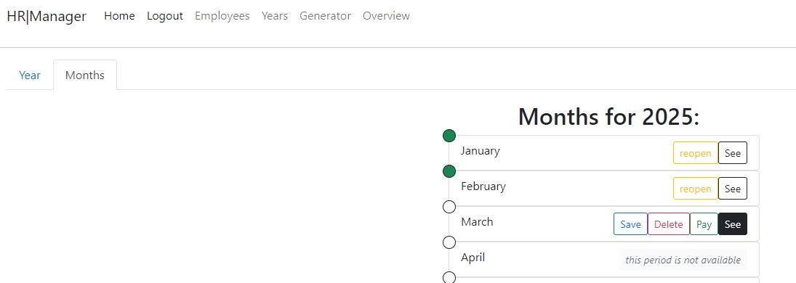

You can see that the current month is 'March'. You can *Save* / *Delete* / *Pay* but not yet *See* (since nothing has been calculated yet, calculation is triggered when the client click on *Save*). 

Badges on the left indicate, whether the salaries have been 'Paid' **Green** or 'calculated/saved' **Blue** or 'not yet' **White**. 

'April' is the next month and we can read "this period is not available". As we already mentioned, this process oriented app needs the client to go from month to month, which is usercase relevant. 

Once the salaries have been 'Paid' (**Green** badge), two other button come up: 'reopen' and 'See'. You can 'reopen' the very last 'Paid' salary, here 'February' and go through the same process again after modifying 'Year' rates (appart form the 'year' itself if already used in a process) or 'Employees' informations (appart from the 'title' if already used in a process). 

All CRUD (Create/Read/Update/Delete), data validation for forms as well as messaging to the client are properly handled, in order to offer the best client experience. Once 'Save as been clicked , we see the badge become **Blue** and a message informes us that the salaries have been succesfully saved. 'Pay' is only now possible.

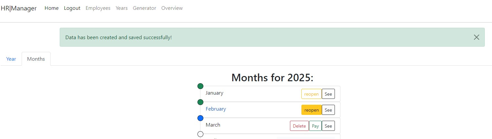

Once 'Pay' as been clicked we see the badge of the concerned month become **Green** and the previously 'not available' month become 'available' with all the button for CRUD. 'March' is now ready to be 'reopened' or 'Seen'. A new message appear to inform us that the payment has been successful. 

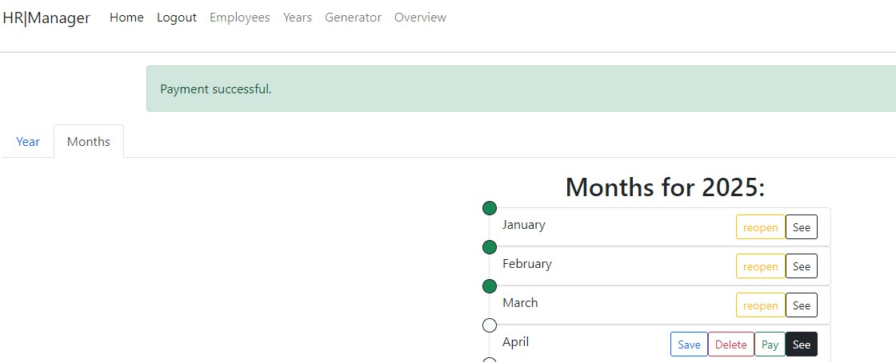

The overall logic of this is describe by these steps (left to right)
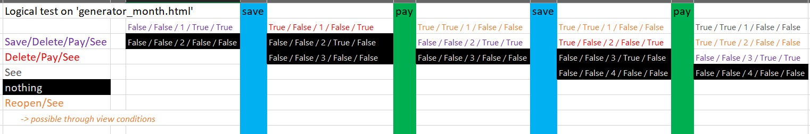

#### C) Overview the data:
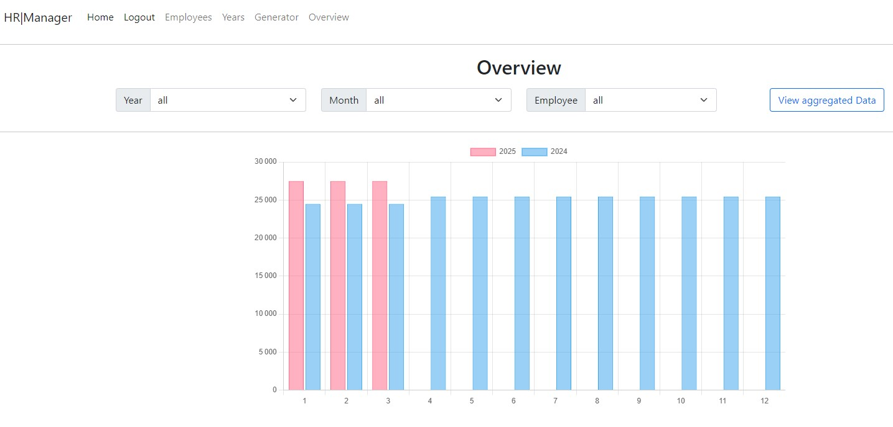

You can watch the progression of the wages over the span of two consecutive years. If you click on 'View aggregated Data' (which you can filter with the help of the three lists: 'Year', 'Month' and 'Employee') you can access a table showing all calculation, you can also export the table in excel. 

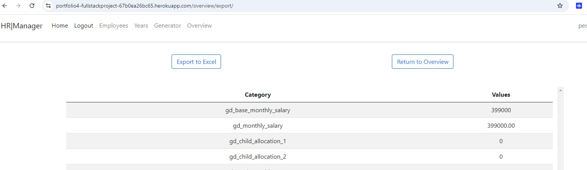


## Testing
We implemented automatic test with python, see:
- tests_amdin.py
- tests_models.py
- tests_views.py

We tested each CRUD element, messaging and data valiation manually. All are functional. 

We tested responsiveness with chrome developper tool kit manually. We saw that all device displayed everything right. 

We tested our statics files .css , with [jigsaw](https://jigsaw.w3.org/css-validator) and no error where found. 

We tested our static file .js (also the script that we have on template 'overview.html) with [jshint](https://jshint.com/) and no error where found.

We also tested our .html templates with [validator.w3](https://validator.w3.org/#validate_by_input), and we found one ```</span>``` that needed to be deleted. 


## Performance
We tested the performance of our app with lighthouse, the result are good. 

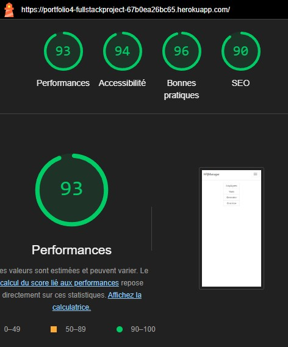


## Bugs fixed / Possible upgrade 
### Bugs fixed:
- url name='generator_year' gave a mistake when no years was populated by user first: deal with the error by setting default values to 0 and adding messages
- We had to delete all migrations made, because we changed it, then received this message: "You are trying to change the nullable field 'start_date' on employees to non-nullable without a default; we can't do that (the database needs something to populate existing rows).
Please select a fix:" and gave it a wrong default value
- parsing dates + date format

### Possible ugprade:
- Make possible on 'overview' to filter also the graph with the filters: 'Year' / 'Month' / 'Employee'
- Give a bit more design to it.
- Create account for Employees while creating an 'Employee' itself in the app, sending an automatic email with connection informations. Giving Employees restricted authorisation on data (only theirs).


## Technologies used
- Python / Django
- PostgreSQL with [MyElephant](https://www.elephantsql.com/) => EoS early 2025
- Database for pictures with [Cloudinary](https://cloudinary.com/)
- Embedded graph, using **Chart.js**


## Installation
1. Clone the Repository
```<git clone <repository-url>>```
```<cd app name>```
2. Set up virtual Environment
```<python -m venv venv>```
```<venv\Scripts\activate> (Windows)```
3. Install Requirements
```<pip install -r requirements.txt>```
4. Configure Environnement variables, file name **env.py** for secret keys/urls.
5. Apply Migrations
```<python manage.py makemigrations>```
```<python manage.py migrate>```
6. Create Superuser
```<python manage.py createsuperuser>```
7. Run the server
```<python manage.py runserver>```


## Heroku deployment
1. Install [Heroku CLI](https://devcenter.heroku.com/articles/heroku-cli)
2. Log in to Heroku, through your command line
<heroku login>
3. Create a Heroku app
<heroku create your-app-name>
4. Add Heroku PostgreSQL add-on
<heroku addons:create heroku-postgresql:hobby-dev>
5. Configure Settings
set 'DEBUGS' to False
update 'ALLOWED_HOSTS' = ['your-app-name.herokuapp.com'] 
update 'DATABASES' = {'default': dj_database_url.parse(os.environ.get('DATABASE_URL'))} #refers to your env.py, do not forget to import dj_databse_url and os
6. Create a file named 'Procfile' in the root of your project
<web: gunicorn your-app-name.wsgi>
7. Static files configuration
'STATIC_ROOT' / 'STATIC_URL' / 'STATICFILES_STORAGE' (cloudinary for instance)
8. Install gunicorn (update requirements.txt)
<pip install gunicorn>
9. Update your middleware in 'settings.py'
10. Push to Heroku
<git add .>
<git commit -m "Update:Heroku deployment">
<git push heroku master/main>
11. Run Migrations
<heroku run python manage.py migrate>
12. Create superuser
<heroku run python manage.py createsuperuser>
13. Here you go, access your app at 'https://your-app-name.herokuapp.com'


## Credits
- I found help on [stackoverflow](https://stackoverflow.com/)
- I also used [codeInstitute](https://codeinstitute.net/global/) examples


## Acknowledgements
- [Django Documentation](https://docs.djangoproject.com/) for the website architecture
- [Chart.js](https://www.chartjs.org/) for chart rendering
- [Boostrap](https://getbootstrap.com/) for the frontend styling


## Contributors / License
- Cyril Bromberger - Project Owner
- This project is licensed under the MIT License. Feel free to use and modify it as per your needs.


## Find this web site:
[Github page](https://github.com/Cyril-CRGB/Portfolio4_FullStackProject)
[The site is live here](https://portfolio4-fullstackproject-67b0ea26bc65.herokuapp.com/)
Credentials for visitors
user: **Admin**
Password: **br5*9v/iOG;6**


