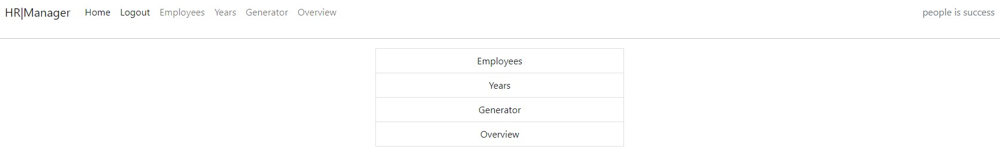

# Django Payroll Management System

## Description
The Django Payroll Management System is a web-based application designed to manage employee payroll, salary and related data. 
It includes features such as employee management, salary year configuration, salary data generation, and reports for both current and previous years. A **export** in excel is also possible. This project leverages Django for backend processing and database management, and uses templates for the fronted user interface.

## Features

- Employees: Add, modify, and delete employees. Employees can be marked as active or inactive. 
    *(for modification and deletion, only possible if no data is generated for it.)*
- Year: Add, modify, and delete years.
    *(for modification and deletion, only possible if no data is generated for it.)*
- Generator: Generate monthly salary data for active employees, with the ability to save, modify, delete, pay, and reopen for each month of the year.
- Overview: View aggregated data in charts to compare salary data over different months and years, you also have the possiblity to export in excel.

As it is a Process oriented app, you need to create 'Employees' and 'Years' before generating any salary and overviewing them. Moreover you need to go through specific steps in order to achieve the payroll monthly job. 

This app is called 'HR MANAGER' and it is part of a larger project called 'OCTOPUS', have a look at the schematic:

The site is live here : https://portfolio4-fullstackproject-67b0ea26bc65.herokuapp.com/

Credentials for visitors
user: Admin
Password: br5*9v/iOG;6

Input validation Enhancements summary:
 - Added form-level validations using clean() methods in forms.
 - Implemented model-level validations for added security, ensuring fields have appropriate constraints.
 - Added error messages and validation handling in views using form_invalid() and form_valid() to guide users.
 - Modified templates to properly display error messages to users.
 - Created database constraints and custom signals to prevent inconsistencies even outside of form usage.

 buggs.

 i had to delete all migrations made, because i changed it, then received this message: "You are trying to change the nullable field 'start_date' on employees to non-nullable without a default; we can't do that (the database needs something to populate existing rows).
Please select a fix:" and gave it a wrong default value

parsing dates + date format

python manage.py makemigrations
python manage.py migrate

url name='generator_year' gave a mistake when no years was populated by user first: deal with the error by setting default values to 0 and adding messages
